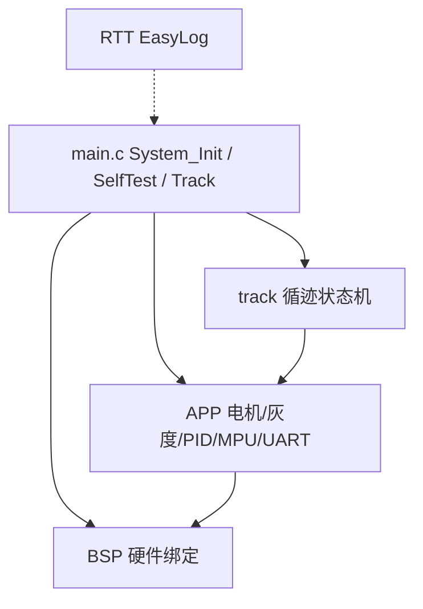
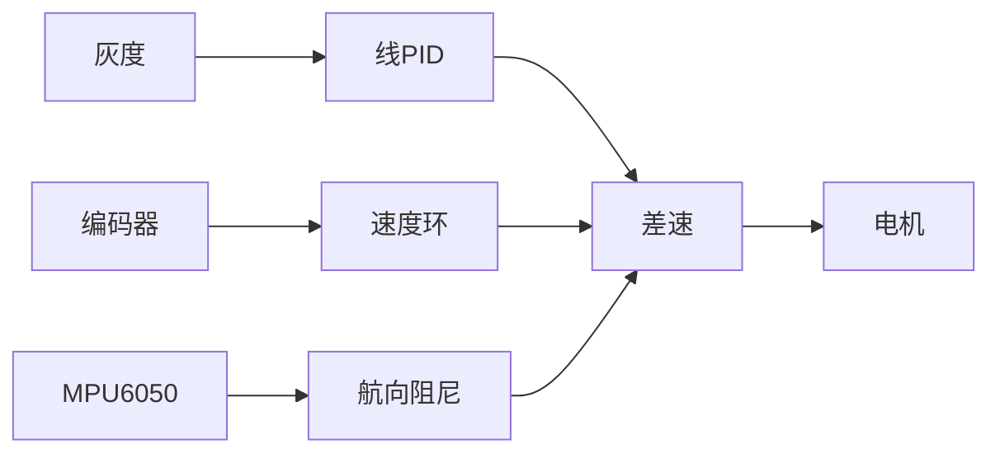

# Mspm0_Line_Follower

MSPM0G3507 循迹车固件：灰度循迹 PID、编码器速度环、MPU6050 航向辅助；APP/BSP/TASK 分层。

## 系统架构图

```mermaid
flowchart TB
  MAIN[main.c System_Init / SelfTest / Track]
  MAIN --> APP[APP 电机/灰度/PID/MPU/UART]
  MAIN --> BSP[BSP 硬件绑定]
  MAIN --> TR[track 循迹状态机]
  APP --> BSP
  TR --> APP
  RTT[RTT EasyLog] -.-> MAIN
```

## 功能框图

```mermaid
flowchart LR
  GRAY[灰度] --> LPID[线PID]
  ENC[编码器] --> SPID[速度环]
  MPU[MPU6050] --> GPID[航向阻尼]
  LPID --> MIX[差速]
  SPID --> MIX
  GPID --> MIX
  MIX --> MOT[电机]
```

## 远程

origin → https://github.com/linxi27667/Mspm0_Line_Follower.git
